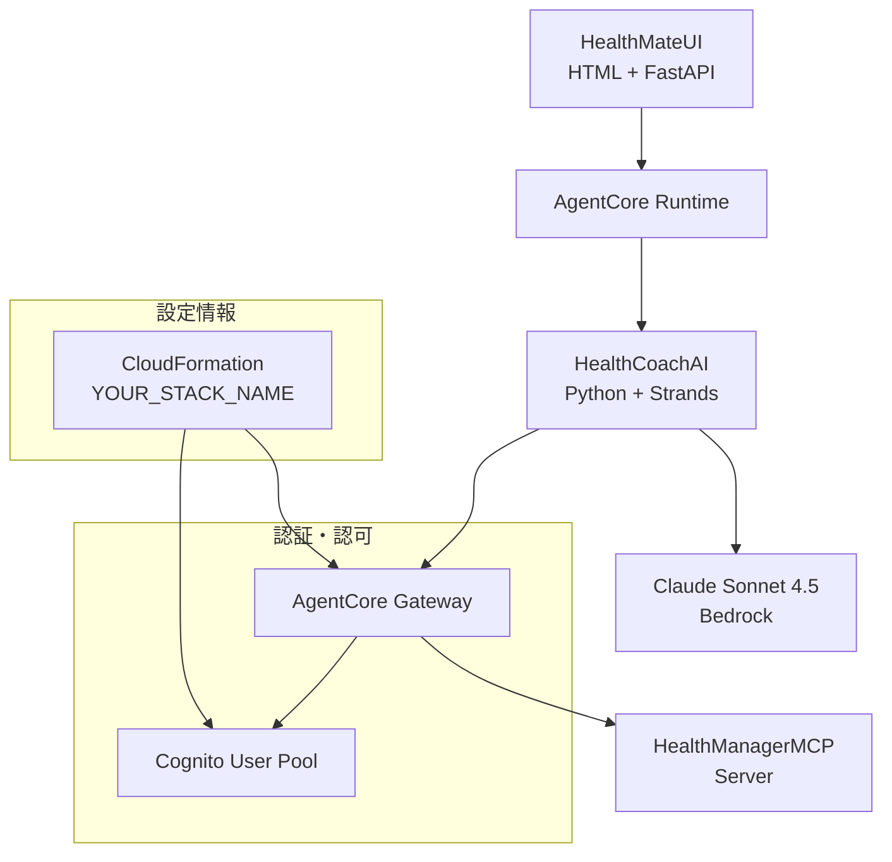

# 設計文書

## 概要

HealthCoachAIは、Amazon Bedrock AgentCore Runtime上で動作するPython + Strands Agentsベースの健康支援AIエージェントです。既存のHealthManagerMCPサーバーとAgentCore Gateway経由で連携し、ユーザの健康データを管理しながらパーソナライズされたコーチングを提供します。

## アーキテクチャ

### システム構成図



### レイヤー構成

1. **プレゼンテーション層**: HealthMateUI（本プロダクトの対象外）
2. **エージェント層**: HealthCoachAI（本プロダクトの主要コンポーネント）
3. **ゲートウェイ層**: AgentCore Gateway（既存インフラ）
4. **データ層**: HealthManagerMCP（既存サーバー）

## コンポーネントと インターフェース

### 主要コンポーネント

#### 1. HealthCoachAgent
- **責務**: メインのAIエージェント実装
- **技術**: Python + Strands Agents + Bedrock AgentCore Runtime
- **機能**: 
  - ユーザとの対話処理
  - 健康データの分析と解釈
  - パーソナライズされたアドバイス生成
  - MCP Gatewayツールの自動選択・使用

#### 2. MCP Gateway Tools (Strands Custom Tools)
- **責務**: HealthManagerMCPとの直接統合
- **技術**: Strands @tool デコレーター + HTTP Client
- **機能**:
  - 健康データ取得ツール
  - 健康目標管理ツール
  - 活動記録管理ツール
  - OAuth認証付きMCP呼び出し

#### 3. ConfigurationManager
- **責務**: 設定情報の管理
- **技術**: AWS SDK for Python (boto3)
- **機能**:
  - CloudFormationスタック情報の取得
  - MCP Gateway接続情報の取得
  - 環境設定の管理

#### 4. AuthenticationService
- **責務**: 認証・認可の処理（ツール内で使用）
- **技術**: OAuth2 Client Credentials Flow
- **機能**:
  - アクセストークンの取得・更新
  - 認証エラーの処理

### インターフェース定義

#### HealthManagerMCP Tools（実際の機能）
```python
# 利用可能なMCPツール
tools = {
    "userManagement": "UserManagement",           # ユーザ情報の管理
    "healthGoalManagement": "HealthGoalManagement", # 健康目標の設定・追跡
    "healthPolicyManagement": "HealthPolicyManagement", # 健康ポリシーの管理
    "activityManagement": "ActivityManagement"    # 活動記録の管理
}

# DynamoDBテーブル構成
tables = {
    "users": "healthmate-users",        # ユーザ情報
    "goals": "healthmate-goals",        # 健康目標
    "policies": "healthmate-policies",  # 健康ポリシー
    "activities": "healthmate-activities" # 活動記録
}
```

#### CloudFormation Stack Outputs（例）
```yaml
Outputs:
  MCPConnectionConfig:
    Description: "Complete MCP connection configuration (JSON)"
    Value: |
      {
        "gatewayEndpoint": "https://your-gateway-id.gateway.bedrock-agentcore.your-region.amazonaws.com/mcp",
        "authConfig": {
          "type": "oauth2",
          "authorizationUrl": "https://your-domain.auth.your-region.amazoncognito.com/oauth2/authorize",
          "tokenUrl": "https://your-domain.auth.your-region.amazoncognito.com/oauth2/token",
          "userInfoUrl": "https://your-domain.auth.your-region.amazoncognito.com/oauth2/userInfo",
          "clientId": "your-client-id",
          "scopes": ["openid", "profile", "email", "phone"]
        },
        "tools": {
          "userManagement": "UserManagement",
          "healthGoalManagement": "HealthGoalManagement", 
          "healthPolicyManagement": "HealthPolicyManagement",
          "activityManagement": "ActivityManagement"
        },
        "region": "your-region",
        "accountId": "your-account-id"
      }
  GatewayName: "your-gateway-name"
  GatewayArn: "arn:aws:bedrock-agentcore:your-region:your-account-id:gateway/your-gateway-id"
  UserPoolId: "your-user-pool-id"
  UserPoolClientId: "your-client-id"
  TokenUrl: "https://your-domain.auth.your-region.amazoncognito.com/oauth2/token"
  DiscoveryUrl: "https://cognito-idp.your-region.amazonaws.com/your-user-pool-id/.well-known/openid-configuration"
```

## データ統合アプローチ

### MCP Gateway経由のデータアクセス

HealthCoachAIは、カスタムデータモデルを定義せず、以下のアプローチでデータを扱います：

1. **動的データ処理**: エージェント（LLM）がMCPサーバーから返されるJSONデータを自動解釈
2. **スキーマレス設計**: 固定的なデータクラスではなく、柔軟なDict/JSON形式でデータを処理
3. **ツールベース統合**: Strandsカスタムツールを通じてMCP Gatewayと直接通信

### Strands Custom Tools実装例

```python
from strands import tool
import httpx
import os

@tool
async def get_user_health_data(user_id: str, data_type: str = None) -> str:
    """
    ユーザーの健康データを取得します
    
    Args:
        user_id: ユーザーID
        data_type: データタイプ（weight, blood_pressure, steps等）
    
    Returns:
        JSON形式の健康データ
    """
    # OAuth認証
    token = await get_oauth_token()
    
    # MCP Gateway呼び出し
    async with httpx.AsyncClient() as client:
        response = await client.post(
            os.environ['GATEWAY_MCP_URL'],
            headers={"Authorization": f"Bearer {token}"},
            json={
                "jsonrpc": "2.0",
                "method": "tools/call",
                "params": {
                    "name": "UserManagement",
                    "arguments": {"user_id": user_id, "data_type": data_type}
                }
            }
        )
    
    return response.json()

@tool
async def create_health_goal(user_id: str, goal_data: dict) -> str:
    """
    新しい健康目標を作成します
    
    Args:
        user_id: ユーザーID
        goal_data: 目標データ（辞書形式）
    
    Returns:
        作成された目標のJSON
    """
    token = await get_oauth_token()
    
    async with httpx.AsyncClient() as client:
        response = await client.post(
            os.environ['GATEWAY_MCP_URL'],
            headers={"Authorization": f"Bearer {token}"},
            json={
                "jsonrpc": "2.0",
                "method": "tools/call",
                "params": {
                    "name": "HealthGoalManagement",
                    "arguments": {"user_id": user_id, "action": "create", "data": goal_data}
                }
            }
        )
    
    return response.json()
```

### 設定データモデル

```python
@dataclass
class MCPConfiguration:
    # CloudFormationスタックから動的取得される値
    gateway_endpoint: str
    gateway_name: str
    cognito_user_pool_id: str
    cognito_client_id: str
    cognito_client_secret: str  # AWS APIから動的取得
    token_url: str
    discovery_url: str
    region: str
    account_id: str
    
    @classmethod
    def from_cloudformation(cls, stack_name: str = "YOUR_STACK_NAME") -> "MCPConfiguration":
        """CloudFormationスタックから設定を動的取得"""
        import boto3
        import json
        
        cfn = boto3.client('cloudformation')
        cognito = boto3.client('cognito-idp')
        
        # スタック出力を取得
        response = cfn.describe_stacks(StackName=stack_name)
        outputs = {o['OutputKey']: o['OutputValue'] for o in response['Stacks'][0]['Outputs']}
        
        # MCPConnectionConfigからJSONパース
        mcp_config = json.loads(outputs['MCPConnectionConfig'])
        
        # Cognito Client Secretを動的取得
        client_secret = cognito.describe_user_pool_client(
            UserPoolId=outputs['UserPoolId'],
            ClientId=outputs['UserPoolClientId']
        )['UserPoolClient']['ClientSecret']
        
        return cls(
            gateway_endpoint=mcp_config['gatewayEndpoint'],
            gateway_name=outputs['GatewayName'],
            cognito_user_pool_id=outputs['UserPoolId'],
            cognito_client_id=outputs['UserPoolClientId'],
            cognito_client_secret=client_secret,
            token_url=outputs['TokenUrl'],
            discovery_url=outputs['DiscoveryUrl'],
            region=outputs['Region'],
            account_id=outputs['AccountId']
        )
    
@dataclass
class AgentConfiguration:
    llm_model: str = "anthropic.claude-3-5-sonnet-20241022-v2:0"
    max_conversation_turns: int = 50
    health_data_cache_ttl: int = 300  # 5分
    stack_name: str = "YOUR_STACK_NAME"  # 環境変数で上書き可能
```

## 正確性プロパティ

*プロパティとは、システムの全ての有効な実行において真であるべき特性や動作のことです。本質的に、システムが何をすべきかについての形式的な記述です。プロパティは、人間が読める仕様と機械で検証可能な正確性保証の橋渡しとして機能します。*

### プロパティ反映

プリワーク分析を確認した結果、以下の冗長性を特定しました：

- **認証関連**: プロパティ2.1（OAuth認証）とプロパティ7.2（Cognito認証）は同じ認証プロセスを指しているため、統合可能
- **データ保存**: プロパティ3.2（健康データ保存）とプロパティ4.2（目標保存）は同じMCP経由保存パターンのため、統合可能
- **エラー処理**: プロパティ2.4（データアクセスエラー）とプロパティ3.4（更新エラー）は類似のエラーハンドリングパターンのため、統合可能

### 統合後の正確性プロパティ

**プロパティ 1: 健康関連対話の適切性**
*任意の*ユーザからの健康関連の入力に対して、HealthCoachAIは適切で支援的な健康指導を提供する
**検証対象: 要件 1.1, 1.2, 1.3**

**プロパティ 2: 会話コンテキストの維持**
*任意の*会話セッションにおいて、HealthCoachAIは対話全体を通してコンテキストを維持する
**検証対象: 要件 1.4**

**プロパティ 3: 不適切要求の拒否**
*任意の*不適切な健康要求に対して、HealthCoachAIは拒否し医療専門家への誘導を行う
**検証対象: 要件 1.5**

**プロパティ 4: 統合認証システム**
*任意の*外部サービスアクセス時に、HealthCoachAIはOAuth/Bearer認証とCognito認証システムを使用する
**検証対象: 要件 2.1, 7.2**

**プロパティ 5: MCP経由データアクセス**
*任意の*健康情報取得時に、HealthCoachAIはAgentCore Gateway経由でHealthManagerMCPにアクセスする
**検証対象: 要件 2.2**

**プロパティ 6: データ活用の個人化**
*任意の*取得された健康データは、パーソナライズされた推奨事項に組み込まれる
**検証対象: 要件 2.3**

**プロパティ 7: 安全なデータ処理**
*任意の*機密健康データアクセス時に、HealthCoachAIは安全な送信と処理を確保する
**検証対象: 要件 2.5**

**プロパティ 8: データ検証と保存**
*任意の*新しい健康データまたは目標について、HealthCoachAIは検証後にHealthManagerMCP経由で保存する
**検証対象: 要件 3.1, 3.2, 4.2**

**プロパティ 9: 成功時の確認通知**
*任意の*成功したデータ更新または目標設定に対して、HealthCoachAIはユーザに確認を提供する
**検証対象: 要件 3.3**

**プロパティ 10: 統合エラーハンドリング**
*任意の*データアクセスまたは更新エラー時に、HealthCoachAIは再試行を行い、持続的問題をユーザに通知する
**検証対象: 要件 2.4, 3.4**

**プロパティ 11: 無効データの処理**
*任意の*無効な健康データに対して、HealthCoachAIはユーザに明確化または修正を要求する
**検証対象: 要件 3.5**

**プロパティ 12: 目標策定支援**
*任意の*健康目標表明に対して、HealthCoachAIは具体的で測定可能な目標策定を支援する
**検証対象: 要件 4.1**

**プロパティ 13: 進捗追跡と比較**
*任意の*進捗追跡時に、HealthCoachAIは現在の健康データを確立された目標と比較する
**検証対象: 要件 4.3**

**プロパティ 14: 進歩時の肯定的強化**
*任意の*目標に向けた進歩検出時に、HealthCoachAIは肯定的な強化と励ましを提供する
**検証対象: 要件 4.4, 5.4**

**プロパティ 15: 未達成時の建設的提案**
*任意の*目標未達成時に、HealthCoachAIは調整や代替アプローチを提案する
**検証対象: 要件 4.5**

**プロパティ 16: データ分析とパターン特定**
*任意の*健康データ分析時に、HealthCoachAIは意味のあるパターンと傾向を特定し説明する
**検証対象: 要件 5.1, 5.2**

**プロパティ 17: 懸念パターンの警告**
*任意の*懸念すべきパターン検出時に、HealthCoachAIは警告と適切な行動提案を行う
**検証対象: 要件 5.3**

**プロパティ 18: データ不足時の対応**
*任意の*分析用データ不足時に、HealthCoachAIは追加情報要求またはデータ収集戦略を提案する
**検証対象: 要件 5.5**

**プロパティ 19: 応答時間の遵守**
*任意の*ユーザリクエストに対して、HealthCoachAIは許容可能な時間制限内で応答する
**検証対象: 要件 6.2**

**プロパティ 20: エラーログの記録**
*任意の*システムエラー発生時に、HealthCoachAIは適切な診断情報をログに記録する
**検証対象: 要件 6.3**

**プロパティ 21: 依存関係障害時の劣化**
*任意の*外部依存関係障害時に、HealthCoachAIは適切に劣化しユーザに通知する
**検証対象: 要件 6.4**

**プロパティ 22: 既存設定の使用**
*任意の*HealthManagerMCP接続時に、HealthCoachAIは既存のAgentCore Gateway設定を使用する
**検証対象: 要件 7.1**

**プロパティ 23: UI統合の適切性**
*任意の*HealthMateUIからの呼び出しに対して、HealthCoachAIはUI固有APIを必要とせず適切に応答する
**検証対象: 要件 7.3**

**プロパティ 24: 設定変更への適応**
*任意の*設定変更時に、HealthCoachAIはコード修正を必要とせずに適応する
**検証対象: 要件 7.4**

**プロパティ 25: インフラコンポーネントの発見**
*任意の*CloudFormationスタックリソース統合時に、HealthCoachAIは既存インフラコンポーネントを発見し使用する
**検証対象: 要件 7.5**

## エラーハンドリング

### エラー分類と対応戦略

#### 1. 認証・認可エラー
- **OAuth トークン期限切れ**: 自動リフレッシュ機能
- **Cognito認証失敗**: 再認証プロンプト
- **権限不足**: 適切なエラーメッセージとログ記録

#### 2. MCP通信エラー
- **ネットワーク接続エラー**: 指数バックオフによる再試行
- **ゲートウェイタイムアウト**: タイムアウト設定の調整と再試行
- **レート制限**: 適切な待機時間での再試行

#### 3. データ検証エラー
- **無効な健康データ**: ユーザーへの明確な修正指示
- **形式エラー**: 期待される形式の例示
- **範囲外の値**: 妥当な範囲の提示

#### 4. システムリソースエラー
- **メモリ不足**: ガベージコレクションとキャッシュクリア
- **処理時間超過**: 処理の分割と段階的実行
- **AgentCore Runtime制限**: 適切な劣化モード

### エラー回復メカニズム

```python
@dataclass
class ErrorRecoveryConfig:
    max_retries: int = 3
    base_delay: float = 1.0
    max_delay: float = 60.0
    exponential_base: float = 2.0
    jitter: bool = True
    
class ErrorHandler:
    def handle_mcp_error(self, error: MCPError) -> RecoveryAction
    def handle_auth_error(self, error: AuthError) -> RecoveryAction
    def handle_validation_error(self, error: ValidationError) -> UserMessage
    def handle_system_error(self, error: SystemError) -> SystemAction
```

## テスト戦略

### デュアルテストアプローチ

本システムでは、ユニットテストとプロパティベーステストの両方を実装し、包括的なテストカバレッジを実現します。

#### ユニットテスト
- **具体的な例とエッジケースの検証**
- **コンポーネント間の統合ポイントのテスト**
- **特定のエラー条件の検証**

#### プロパティベーステスト
- **全入力に対して成り立つべき普遍的プロパティの検証**
- **ランダム入力による広範囲なテストカバレッジ**
- **システムの一般的な正確性の保証**

### プロパティベーステストライブラリ

**選択ライブラリ**: Hypothesis (Python)
- 理由: Pythonエコシステムでの標準的なプロパティベーステストライブラリ
- 豊富なデータ生成機能とShrinking機能
- Strands Agentsとの統合が容易

### テスト設定要件

- **最小実行回数**: 各プロパティテストは100回以上実行
- **タグ付け**: 各プロパティベーステストに設計文書の対応プロパティを明記
- **タグ形式**: `**Feature: health-coach-ai, Property {number}: {property_text}**`

### テスト実装例

```python
from hypothesis import given, strategies as st
import pytest

class TestHealthCoachProperties:
    
    @given(st.text(min_size=1))
    def test_property_1_health_dialogue_appropriateness(self, health_query):
        """**Feature: health-coach-ai, Property 1: 健康関連対話の適切性**"""
        response = health_coach.process_health_query(health_query)
        assert is_appropriate_health_guidance(response)
        assert is_supportive_tone(response)
    
    @given(st.lists(st.text(), min_size=2, max_size=10))
    def test_property_2_context_maintenance(self, conversation_turns):
        """**Feature: health-coach-ai, Property 2: 会話コンテキストの維持**"""
        session = health_coach.start_session()
        for turn in conversation_turns:
            session.add_message(turn)
        
        assert session.maintains_context()
        assert session.can_reference_previous_turns()
```

### テスト環境とモック戦略

#### 統合テスト環境
- **実際のAgentCore Gateway**: テスト用ゲートウェイインスタンス
- **モックMCPサーバー**: 予測可能なレスポンス用
- **Cognito テスト環境**: 認証フローのテスト用

#### モック使用指針
- **外部依存関係**: AWS サービス呼び出しのモック
- **ネットワーク通信**: HTTP リクエスト/レスポンスのモック
- **時間依存処理**: 時刻制御のためのモック

ただし、プロパティベーステストでは可能な限り実際の機能を使用し、モックは最小限に留めます。

## エラーハンドリング

### エラー分類と対応戦略

#### 1. 認証・認可エラー
- **OAuth トークン期限切れ**: 自動リフレッシュ機能
- **Cognito認証失敗**: 再認証プロンプト
- **権限不足**: 適切なエラーメッセージとログ記録

#### 2. MCP通信エラー
- **ネットワーク接続エラー**: 指数バックオフによる再試行
- **ゲートウェイタイムアウト**: タイムアウト設定の調整と再試行
- **レート制限**: 適切な待機時間での再試行

#### 3. データ検証エラー
- **無効な健康データ**: ユーザーへの明確な修正指示
- **形式エラー**: 期待される形式の例示
- **範囲外の値**: 妥当な範囲の提示

#### 4. システムリソースエラー
- **メモリ不足**: ガベージコレクションとキャッシュクリア
- **処理時間超過**: 処理の分割と段階的実行
- **AgentCore Runtime制限**: 適切な劣化モード

### エラー回復メカニズム

```python
@dataclass
class ErrorRecoveryConfig:
    max_retries: int = 3
    base_delay: float = 1.0
    max_delay: float = 60.0
    exponential_base: float = 2.0
    jitter: bool = True
    
class ErrorHandler:
    def handle_mcp_error(self, error: MCPError) -> RecoveryAction
    def handle_auth_error(self, error: AuthError) -> RecoveryAction
    def handle_validation_error(self, error: ValidationError) -> UserMessage
    def handle_system_error(self, error: SystemError) -> SystemAction
```

## テスト戦略

### デュアルテストアプローチ

本システムでは、ユニットテストとプロパティベーステストの両方を実装し、包括的なテストカバレッジを実現します。

#### ユニットテスト
- **具体的な例とエッジケースの検証**
- **コンポーネント間の統合ポイントのテスト**
- **特定のエラー条件の検証**

#### プロパティベーステスト
- **全入力に対して成り立つべき普遍的プロパティの検証**
- **ランダム入力による広範囲なテストカバレッジ**
- **システムの一般的な正確性の保証**

### プロパティベーステストライブラリ

**選択ライブラリ**: Hypothesis (Python)
- 理由: Pythonエコシステムでの標準的なプロパティベーステストライブラリ
- 豊富なデータ生成機能とShrinking機能
- Strands Agentsとの統合が容易

### テスト設定要件

- **最小実行回数**: 各プロパティテストは100回以上実行
- **タグ付け**: 各プロパティベーステストに設計文書の対応プロパティを明記
- **タグ形式**: `**Feature: health-coach-ai, Property {number}: {property_text}**`

### テスト実装例

```python
from hypothesis import given, strategies as st
import pytest

class TestHealthCoachProperties:
    
    @given(st.text(min_size=1))
    def test_property_1_health_dialogue_appropriateness(self, health_query):
        """**Feature: health-coach-ai, Property 1: 健康関連対話の適切性**"""
        response = health_coach.process_health_query(health_query)
        assert is_appropriate_health_guidance(response)
        assert is_supportive_tone(response)
    
    @given(st.lists(st.text(), min_size=2, max_size=10))
    def test_property_2_context_maintenance(self, conversation_turns):
        """**Feature: health-coach-ai, Property 2: 会話コンテキストの維持**"""
        session = health_coach.start_session()
        for turn in conversation_turns:
            session.add_message(turn)
        
        assert session.maintains_context()
        assert session.can_reference_previous_turns()
```

### テスト環境とモック戦略

#### 統合テスト環境
- **実際のAgentCore Gateway**: テスト用ゲートウェイインスタンス
- **モックMCPサーバー**: 予測可能なレスポンス用
- **Cognito テスト環境**: 認証フローのテスト用

#### モック使用指針
- **外部依存関係**: AWS サービス呼び出しのモック
- **ネットワーク通信**: HTTP リクエスト/レスポンスのモック
- **時間依存処理**: 時刻制御のためのモック

ただし、プロパティベーステストでは可能な限り実際の機能を使用し、モックは最小限に留めます。